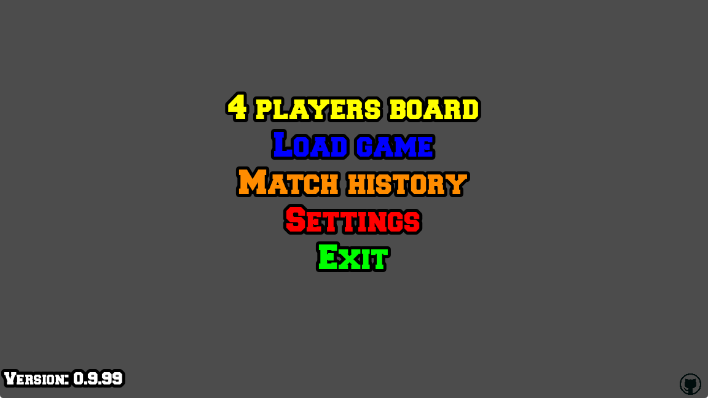
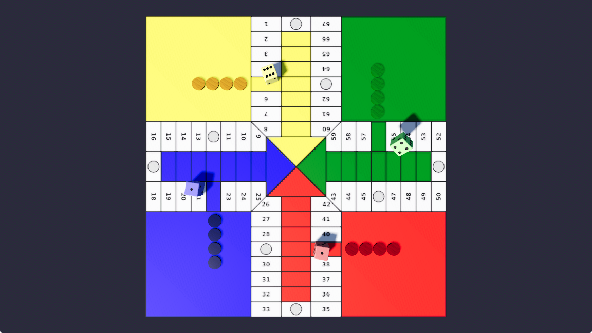
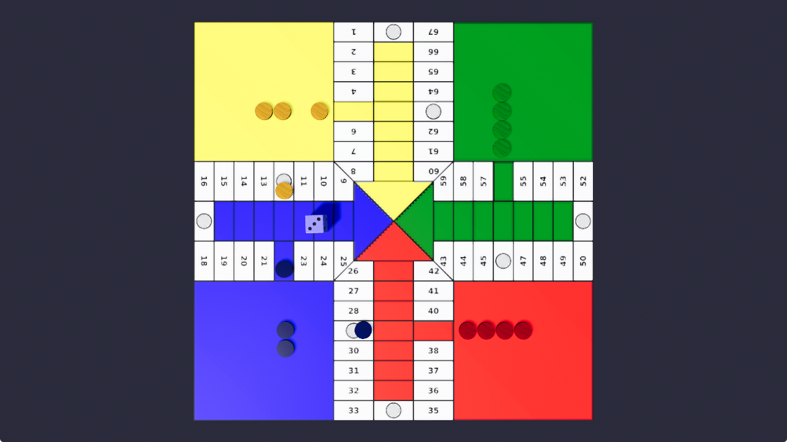

# User Manual - GDParchis 🎲 🏆

Welcome to **GDParchis**, a 3D adaptation of the classic Parchís board game built in Godot Engine 4.7.

---

## 📋 Table of Contents
1. [Initial Game Setup](#1-initial-game-setup)
2. [Determining the Starting Player (Dice Roll)](#2-determining-the-starting-player-dice-roll)
3. [Game Rules & Movement Mechanics](#3-game-rules--movement-mechanics)
   - [Exiting Home](#exiting-home)
   - [Square Capacity & Barrier Rules](#square-capacity--barrier-rules)
   - [Capturing (Eating Pieces) & +20 Bonus](#capturing-eating-pieces--20-bonus)
   - [Reaching Goal & +10 Bonus](#reaching-goal--10-bonus)
   - [Rolling a 6](#rolling-a-6)
4. [Board Square Types](#4-board-square-types)
5. [Match History Viewer](#5-match-history-viewer)
6. [Controls & Accessibility](#6-controls--accessibility)

---

## 1. Initial Game Setup



Upon launching the game, you will enter the **Player Selection Menu**:

- **Player Count & Board Selection:** Select 3, 4, 6, or 8 player board modes for the match.
- **Color Assignments:**
  - Player 0: Yellow 🟡
  - Player 1: Blue 🔵
  - Player 2: Red 🔴
  - Player 3: Green 🟢
  - Player 4: Orange 🟠 (6/8 Player Modes)
  - Player 5: Purple 🟣 (6/8 Player Modes)
  - Player 6: Cyan 🩵 (8 Player Mode)
  - Player 7: Magenta 🩷 (8 Player Mode)
- **Player Types:** Toggle each player slot between **Human Player** or **Artificial Intelligence (AI)**.
- **Custom Player Names:** Enter custom names for each player to be displayed during in-game floating text announcements and in post-game Match History logs.

---

## 2. Determining the Starting Player (Dice Roll)



Before moving pieces on the board:

1. The **Starting Roll** screen is presented.
2. Each player rolls their 3D die by clicking their roll button.
3. **Visual Comparison:** All rolled dice remain visible on screen simultaneously to compare values.
4. The player rolling the highest value takes the first turn.
5. **Tie-Breakers:** If two or more players tie for the highest roll, only the tied candidates roll again in subsequent rounds until a single winner is determined.

---

## 3. Game Rules & Movement Mechanics



### Exiting Home
- All 4 pieces start inside their color-coded home base (route position 0).
- Moving a piece out of home onto the **Home Exit Square** (route position 1) requires rolling a **5**.
- **Capacity Limit (2 Pieces):** If the exit square already contains 2 pieces of the same player, rolling a 5 **cannot move a 3rd piece out of home**, because the square is at maximum capacity (2 pieces).

### Square Capacity & Barrier Rules
- Any square on the board can hold a **maximum of 2 pieces**.
- **Barrier / Bridge Formation:** When 2 pieces of the same player occupy the same square, they form a **Barrier**.
- **Blocking:** No piece (enemy or friendly) can leap over or pass through a barrier.
- **Opening a Barrier:** If a player owns a barrier and rolls a **6**, they are mandated to break the barrier by moving one of its 2 pieces if a legal move exists.

### Capturing (Eating Pieces) & +20 Bonus
- When a piece lands on a normal square occupied by a single opponent piece, the opponent piece is **captured** and sent back to its home base.
- **Bonus:** Capturing an opponent piece grants an immediate bonus move of **+20 squares** with any active piece of the capturing player.

### Reaching Goal & +10 Bonus
- Entering the final goal square (square 76, 84, 92, or 100 depending on color) requires an exact dice count.
- **Bonus:** Every piece that reaches the goal square grants a bonus move of **+10 squares** to another piece of the same player.

### Rolling a 6
- If all 4 pieces of a player are out of home, rolling a **6** advances a piece **7 squares**.
- Rolling three consecutive 6s penalizes the player by sending the last moved piece back to home (unless it has entered the final safe ramp).

---

## 4. Board Square Types

| Square Type | Description |
| :--- | :--- |
| **HOME (`START`)** | Home base starting area for all 4 pieces (requires rolling a 5 to exit). |
| **EXIT (`FIRST`)** | Home exit square where pieces land when exiting home (Yellow: 5, Blue: 22, Red: 39, Green: 56). |
| **SAFE (`SECURE`)** | Marked safe squares where pieces belonging to different players coexist without capturing (e.g. squares 12, 17, 29, 34, 46, 51, 63, 68). |
| **NORMAL (`NORMAL`)** | Standard board path squares where landing on an opponent piece triggers a capture. |
| **GOAL (`END`)** | Final victory square where all 4 pieces must arrive to win the match. |

---

## 5. Match History Viewer

Access the **Match History** screen (`GameHistory`) from the main menu:

- Displays the timestamp for each completed match.
- Logs the **Winner's Player Name** and player type (Human or AI).
- Displays total turn count and match duration.
- Keeps roll statistics for post-match analysis.

---

## 6. Credits & Version Information

Access the **Credits** screen (`Credits`) from the main menu:

- **3D Background Scene:** Features two red-tinted 3D dice standing on their vertices like diamonds, spinning continuously around their vertical Y-axis.
- **Version & Release Info:** Displays the game version (`VERSION`) and version release date (`VERSION_DATE`).
- **Development & License Details:** Highlights development (`turulomio`), engine (`Godot Engine 4.7`), and GNU GPL v3.0 license.
- **Dynamic Copyright Notice:** Displays the copyright range (`© 2024 - <Release Year> turulomio`).

---

## 7. Controls & Accessibility

### 🖥️ Desktop Controls (Keyboard & Mouse)

- **Mouse Interactions:**
  - **Left Click:** Roll 3D dice or select highlighted piece to move.
  - **Shift + Left Click:** Open detailed information popup for targeted piece or dice (showing player name, piece index, square ID & type, route position, threats received from opponent pieces, threats generated on opponent pieces, and turn movement options).
  - **Right Click Drag:** Rotate and orbit 3D board camera.
  - **Scroll Wheel Up / `+` Key:** Zoom 3D camera in.
  - **Scroll Wheel Down / `-` Key:** Zoom 3D camera out.

- **Camera Perspective Shortcuts:**
  - **`F1` / `F2` / `F3` / `F4`:** Switch camera view to Yellow, Blue, Red, or Green player's perspective.
  - **`Shift + F1` / `Shift + F2` / `Shift + F3` / `Shift + F4`:** Switch camera view to Yellow, Blue, Red, or Green player's floor level view.
  - **`F9`:** Bottom camera view angle.
  - **`F10` / `Enter`:** Top-down overhead camera view angle.

- **System & Navigation Shortcuts:**
  - **`F11` / `F` Key:** Toggle fullscreen mode.
  - **`Esc` Key:** Return to Main Menu or exit game.
  - **`S` Key:** Toggle Sound ON / OFF with floating status text.

---

### 📱 Android Controls (Touch & Mobile Gestures)

- **Touch Gestures:**
  - **Tap Screen:** Roll 3D dice or select highlighted piece to move.
  - **Touch Drag:** Rotate and orbit 3D board camera in spherical coordinates.
  - **Long Press on Piece / Dice ($\ge$ 0.4s):** Open detailed information popup for targeted piece or dice (showing player name, piece index, square ID & type, threats received, threats generated, and turn evaluation).
  - **Long Press on Background ($\ge$ 0.4s):** Toggle Sound ON / OFF with floating status text (`S` Key emulation).
  - **Android Back Button / Gesture:** Return to Main Menu or exit game (`Esc` Key emulation).
  - **Native Fullscreen:** Android builds run full-screen natively.

---

### 🐧 Display Server & Platform Support

- **Linux Display Server:** Native **Wayland** support with automatic fallback to X11/XWayland.
- **Android Support:** Embedded local export templates and debug key store configuration for Android APK builds (`arm64-v8a` and `x86_64`).

---

## 8. Developer Calibration Suite (`--calibration`)

GDParchis includes a state-of-the-art interactive 3D board calibration suite built specifically for developers to fine-tune piece positions, sizes, and route geometries in real time.

### 🚀 Launching Developer Calibration Mode
Execute the management CLI command:
```bash
python3 management.py --calibration
```
Selecting a board variant (3, 4, 6, or 8 players) launches the interactive 3D calibration tool.

---

### 🛠️ Key Calibration Features & Mechanics

#### 1. Interactive 3D Drag & Drop with Instant Autosave
- **Mouse Drag:** Left-Click and drag any piece to position it precisely on the board plane $(X, Z)$.
- **Autosave on Release:** Releasing the mouse button automatically persists the updated coordinates and scale factors directly into project dataset files (`res://scenes/board3_calibrated_positions.json`, `res://scenes/board4_calibrated_positions.json`).

#### 2. Fine-Grain Keyboard Nudging
- **`Arrow Keys` / `WASD`:** Nudges the selected piece position in $0.1\text{ cm}$ micro-steps.
- **`Shift` + `Arrow Keys` / `WASD`:** Nudges the selected piece position in larger $0.5\text{ cm}$ steps.

#### 3. Proportional Scale ComboBox (5% - 100%)
- Select any piece and pick a proportional scale from the **Tamaño Proporcional** ComboBox in 5% increments (`100%`, `95%`, `90%`, ..., `5%`) to adapt piece sizes to narrow corridor squares or special goal triangles.

#### 4. 3D Route Line & Directional Arrow Visualizer
- **`Inspección Ruta` ComboBox:** Select a specific player route and slot (e.g. `Ruta Amarillo (P0) - Slot 0`) to render a **3D line overlay with filled directional arrows**.
- **Path Verification:** The 3D line traces the exact route from the home base, through the outer ring, into the final goal corridor, showing the direction of movement.

#### 5. Camera Zoom, Panning (Pan), and Viewport Reset
- **Mouse Wheel / `+` / `-` Keys:** Zoom in up to $12\text{ cm}$ height for micro-inspection or zoom out up to $95\text{ cm}$.
- **Right-Click + Drag:** Pan and shift the camera viewport horizontally and vertically across the board plane.
- **`R` Key / HUD Button:** Instantly resets camera zoom, height, and viewport offset back to default centered position.

#### 6. Multi-Step Undo System (`Ctrl + Z`)
- **`Ctrl + Z` / HUD "Deshacer" Button:** Reverts the last position or scale modification. Holds up to 100 undo snapshots in memory for stress-free editing.

#### 7. Rapid Piece Navigation
- **`N` / `TAB` Key:** Selects the next piece on the board.
- **`P` Key:** Selects the previous piece on the board.

#### 8. Data-Driven Architecture & Filtered Persistence
- **Filtered JSON Saving:** `save_calibration_file()` strictly saves valid square IDs and defined slot indices (`0..max_slots-1`), automatically purging obsolete or stray entries.
- **100% Data-Driven Boards:** In-game boards (`Board3`, `Board4`) read piece positions and scales directly from JSON files, eliminating hardcoded mathematical formulas.


